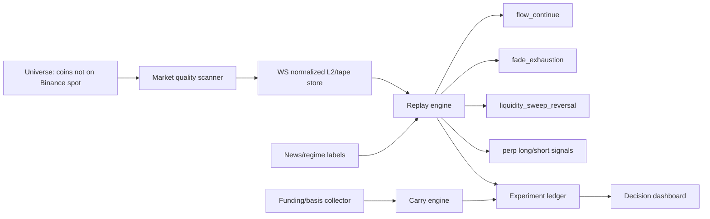

# Аудит канала «Хедлайнеры | Никита Ануфриев»: стратегии, win-rate claims и применимость к trading_mvp

Дата: 2026-06-06  
Статус: v2 / расширенный source packet + decision audit. Цель полного исследования еще не закрыта: YouTube transcript API заблокировал дальнейшие transcript-запросы после 46 видео, поэтому покрытие делится на `catalog-level`, `priority-metadata-level` и `transcript-level`.

## 1. Coverage и артефакты

Канал:
- URL: https://www.youtube.com/@AnufrievNikita/
- Channel id: `UCDy8-SKJCvcp4SegONQJItw`
- Название по YouTube metadata: `Хедлайнеры | Никита Ануфриев`

Собранные артефакты:
- `docs/analysis/2026-06-06-anufriev-final-synthesis-v1.md` — единый русскоязычный итог: выводы, стратегия, экономика, roadmap.
- `docs/analysis/2026-06-06-anufriev-requirements-coverage-audit.md` — requirement-by-requirement audit: что доказано, что частично, что заблокировано transcript/rate-limit.
- `exports/youtube-anufriev/anufriev_flat_videos_20260606.jsonl` — 461 видео из вкладки `/videos`.
- `exports/youtube-anufriev/anufriev_video_catalog_20260606.csv` — полный CSV-каталог.
- `exports/youtube-anufriev/anufriev_trading_relevant_catalog_20260606.csv` — 287 trading/crypto/investing-релевантных видео.
- `exports/youtube-anufriev/anufriev_catalog_summary_20260606.json` — summary по тегам.
- `exports/youtube-anufriev/anufriev_transcript_claim_cards_20260606.jsonl` — 46 transcript-level source cards без сохранения полных транскриптов.
- `exports/youtube-anufriev/anufriev_transcript_claim_summary_20260606.json` — transcript coverage и блокировки.
- `exports/youtube-anufriev/anufriev_priority_video_metadata_20260606.jsonl` — полные metadata по 80 приоритетным trading/crypto видео.
- `exports/youtube-anufriev/anufriev_priority_video_scorecard_v2_20260606.csv` — title-level v2 scorecard: strategy clusters, views, evidence level, participant candidates.
- `exports/youtube-anufriev/anufriev_priority_video_scorecard_v2_summary_20260606.json` — агрегаты по 80 приоритетным видео.
- `exports/youtube-anufriev/anufriev_trading_relevant_metadata_20260606.jsonl` — full metadata dump по всем 287 trading/crypto/investing видео.
- `exports/youtube-anufriev/anufriev_trading_relevant_scorecard_all287_20260606.csv` — compact all-287 scorecard.
- `exports/youtube-anufriev/anufriev_trading_relevant_scorecard_all287_summary_20260606.json` — all-287 strategy/view/participant aggregates.
- `exports/youtube-anufriev/anufriev_transcript_claim_cards_ytdlp_all287_20260606.jsonl` — попытка расширить transcript coverage через YouTube timedtext/json3 auto-captions без сохранения полных транскриптов.
- `exports/youtube-anufriev/anufriev_transcript_retry_queue_20260606.csv` — priority queue из 241 metadata-only видео для повторной transcript-проверки.
- `exports/youtube-anufriev/anufriev_transcript_retry_queue_20260606_summary.json` — формула ранжирования retry queue, counts by cluster, top 30.
- `tools/anufriev_transcript_retry.py` — resumable stdlib-only retry-tool: timedtext/json3, state, rate-limit stop, только короткие claim windows.
- `exports/youtube-anufriev/anufriev_transcript_retry_claim_cards_clean_20260606.jsonl` — clean retry cards по 31 top-priority metadata-only видео.
- `exports/youtube-anufriev/anufriev_transcript_coverage_union_20260606.json` — union coverage после retry: 77 уникальных transcript-backed video ids.
- `exports/youtube-anufriev/anufriev_trading_relevant_scorecard_all287_with_retry_20260606.csv` — обновленная копия scorecard: 46 base transcript cards, 31 retry transcript cards, 210 metadata-only.
- `exports/youtube-anufriev/anufriev_trading_relevant_scorecard_all287_with_retry_summary_20260606.json` — updated all-287 summary после clean retry batch.
- `docs/analysis/2026-06-06-anufriev-retry-batch-source-packet.md` — video-level source packet по clean retry batch.
- `docs/analysis/2026-06-06-anufriev-transcript-retry-plan.md` — план закрытия transcript gaps без усиления metadata-only claims.
- `docs/analysis/2026-06-06-anufriev-strategy-decision-matrix.md` — прикладная decision matrix: strategy rank, participants, economics, backlog, acceptance gates.
- `docs/analysis/2026-06-06-anufriev-strategy-playbook-v1.md` — playbook проверяемых стратегий: setup, data, entry/exit, risk, acceptance gates.
- `docs/analysis/2026-06-06-anufriev-external-evidence-register.md` — внешний evidence register: SEC/FCA/CFTC/ESMA/FINRA/IOSCO/академические источники против claim families.

Coverage:

| Уровень | Количество | Что это значит |
|---|---:|---|
| Все видео канала | 461 | Flat metadata: id, title, duration, url, playlist index |
| Trading/crypto/investing-релевантные | 287 | Отобраны regex-классификацией по заголовкам |
| Full metadata по trading-relevant | 287 | Views, upload_date, descriptions, auto-caption availability |
| Priority metadata scorecard | 80 | Более надежная title-level классификация по свежим/важным trading-видео |
| Transcript cards | 46 | Есть timestamped claim windows; первичная проверка формулировок возможна |
| Transcript failures | 241 | После 46 успешных запросов YouTube начал возвращать IP block |
| Transcript retry queue | 241 | Все metadata-only gaps отсортированы по риску claim family, просмотрам и свежести |
| Transcript-backed union after retry batch | 77 | 31 retry successes; remaining metadata-only в обновленном scorecard: 210 |

Важно: 46 base transcript cards плюс 31 clean retry cards — это не финальное покрытие канала, но это достаточный первичный слой для первых выводов по свежим strategy-видео и сверки с нашим MVP.

Дополнительная проверка через `yt-dlp` timedtext:
- У всех 287 trading-relevant видео есть ru auto-captions в metadata.
- Попытка получить timedtext/json3 дала 22 успешных transcript claim cards, затем YouTube начал отдавать `HTTP 429 Too Many Requests`.
- Эти 22 видео пересекаются со старым transcript-backed набором; pre-retry union transcript coverage оставался 46 уникальных видео.
- Следовательно, all-287 анализ надежен на metadata/title/view уровне, но transcript-level claims остаются ограниченными 77 видео после retry batch.
- Для продолжения создана retry queue на 241 metadata-only видео и безопасный resumable retry-tool: `docs/analysis/2026-06-06-anufriev-transcript-retry-plan.md`.
- Retry batches прошли без 429 и дали 31 clean claim cards; union transcript coverage теперь 77 уникальных видео.

## 1.1. Priority scorecard v2: где у канала реальный фокус

V2 scorecard строился по 80 приоритетным видео. Классификация по заголовкам надежнее первичного regex-pass по описаниям, потому что описания содержат повторяющийся маркетинговый boilerplate и шумят по `ai_trading`/`участником сообщества`.

| Кластер | Видео из 80 | Views в выборке | Что означает для проекта |
|---|---:|---:|---|
| `risk_psychology_playbook` | 19 | 633 872 | Самая частая тема: дисциплина, брифинг, playbook, ошибки. Это не alpha, но обязательная операционная рамка. |
| `ai_trading` | 14 | 505 085 | AI подается как усилитель; переносить в проект как research automation, а не как live decision-maker. |
| `high_winrate_deposit_growth` | 13 | 565 756 | Самый маркетингово-рискованный кластер: требует жесткой проверки EV, выборки, комиссий и survivorship bias. |
| `general_trading` | 13 | 317 664 | Полезен для общих принципов, но мало переносим в код без конкретных setup definitions. |
| `orderbook_scalping` | 11 | 332 595 | Ближайший кластер к `trading_mvp`; именно его мы уже проверяем через L2/tape replay. |
| `legal_regulatory_crypto` | 11 | 710 999 | Самый просматриваемый по views; это risk/compliance слой, не источник сделок. |
| `funding_passive_crypto` | 6 | 524 096 | Реалистичнее как отдельный carry engine, не как high-frequency модуль. |
| `futures_prop_moex` | 6 | 230 934 | Важен как указание на derivatives/short-side, но не переносится напрямую в spot-only bot. |
| `news_event_polymarket` | 5 | 115 878 | Перспективен как regime/catalyst filter поверх исполнения, а не как чистый стаканный сигнал. |

Главный вывод из v2: канал не сводится к HFT. Самые сильные блоки по объему внимания — risk/playbook, юридический crypto-risk, high-winrate/deposit stories и AI/tooling. Для проекта это означает: не расширять только стаканный сигнал, а строить систему отбора рынков/режимов, учета рисков и проверки гипотез.

## 1.1b. All-287 scorecard: полная trading-relevant картина

All-287 scorecard покрывает весь trading/crypto/investing-релевантный каталог, а не только свежие/приоритетные видео. В сумме metadata выборка дает 20 562 076 views.

| Кластер | Видео из 287 | Views | Transcript-backed | Интерпретация |
|---|---:|---:|---:|---|
| `general_trading` | 126 | 10 509 498 | 31 | Самый большой пласт: интервью/истории/общий трейдинг. Много просмотров, но мало конкретного кода без ручного transcript review. |
| `other_trading_adjacent` | 99 | 4 973 922 | 3 | Crypto/DeFi/рынок без явной стратегии. Полезно для контекста, слабая переносимость в bot. |
| `high_winrate_deposit_growth` | 60 | 4 259 014 | 12 | Много сильных claims и историй разгона; это главный слой для критического факт-чека и anti-survivorship bias. |
| `ai_trading` | 50 | 3 252 182 | 6 | Значимый, но не доминирующий кластер. Переносимость: tooling/research, не autonomous live trading. |
| `risk_psychology_playbook` | 36 | 2 087 393 | 8 | Процесс, дисциплина, ошибки; переносить в операционные gates. |
| `orderbook_scalping` | 17 | 944 241 | 7 | Узкий, но наиболее релевантный кластер для `trading_mvp`. |
| `funding_passive_crypto` | 14 | 1 875 562 | 4 | Больше похож на capital allocation/carry, чем на frequent-trading bot. |
| `legal_regulatory_crypto` | 12 | 1 099 537 | 7 | Нужен как compliance/risk слой, особенно для P2P/withdrawals. |
| `futures_prop_moex` | 12 | 1 103 406 | 3 | Подтверждает важность derivatives/short-side, но требует отдельной инфраструктуры. |
| `news_event_polymarket` | 6 | 179 069 | 4 | Малый, но потенциально полезный regime/catalyst layer. |

Разница между all-287 и priority-80 важна:
- All-287 top-by-views доминируют старые общие crypto/trading видео: `zuutaSGleZM`, `IpeygkYEk6o`, `62ciRCvzh10`, `DLjlFGdx32M`, `eUZcEUH_3Ak`.
- Priority-80 сильнее отражает актуальные 2025-2026 темы: order book, AI, legal crypto, funding, market maker narratives.
- Для проекта нужно использовать all-287 как карту канала, но инженерные решения принимать по transcript-backed и свежим priority-видео.

## 1.2. Участники и уровень доказательности

Participant extraction автоматический и частично шумный. Надежными считаются только имена, явно присутствующие в заголовках/metadata или уже покрытые transcript/source packet.

| Участник / выпуск | Кластер | Evidence | Редакторский статус |
|---|---|---|---|
| Андрей Тугарин, `18UNEZr2odw` | legal/regulatory crypto | metadata | Важен для compliance/withdrawal risk, не для alpha. |
| Роман / OpenClaw, `gNQYvQp3lDM` | AI/product/bots | metadata + transcript card | Полезно для productization и automation, но не как доказательство торгового edge. |
| Сергей Алексеев, `-6tKe1FIG4I`, `a1JwFxfgnlc` | high-winrate / market cycle | metadata candidate + transcript card по одному свежему видео | Нужна ручная верификация тезисов, claims про доходность считать high-risk. |
| Ридван Назим, `V6xNos8rAs4` | risk/playbook | metadata | Интересен для правил торговли в разных фазах рынка; transcript пока заблокирован. |
| Михаил Успенский, `6mSzCvWFMSI` | legal crypto | metadata + transcript card | Полезен для правового risk checklist. |
| Михаил Латогузов, `Z5UjQOF7QI0` | orderbook scalping / playbook | metadata + transcript card | Один из наиболее переносимых в проект источников: брифинг, стакан, playbook. |
| Нарэк Григорян, `mcYMwpHCdVM`, `3mBYoA6gqh8` | market maker/manipulation | source packet + transcript card по свежему видео | Использовать как источник гипотез по stop cascade/liquidity sweep, но intent market maker не доказывать без данных. |
| Андрей Демченко, `dLpQ6oHnJIY` | orderbook scalping | source packet | Переносимы идеи L2/tape, неликвидов и frame-by-frame review; claims 90% не переносить без статистики. |
| Льюис Борселино, `nmWaxiP58V4` | futures/prop | metadata + transcript card | Полезен как исторический/futures context, не прямой CEX spot bot blueprint. |
| HAMAHA / Максим, `e2XYurJSIeQ` и смежные | crypto/general | metadata | Требует transcript-level проверки; пока не использовать как основание для инженерных решений. |

## 2. Strategy Taxonomy

| Кластер | Видео/темы канала | Проверка реалистичности | Связь с trading_mvp | Вердикт v1 |
|---|---|---|---|---|
| Order book / tape scalping | `xmXWwzRxYAw`, `FBzZ9SmXJkg`, `7TyVUiYpo7s`, `Z5UjQOF7QI0`, старый выпуск `dLpQ6oHnJIY` | SEC описывает HFT как высокоскоростную, low-latency и order-cancel heavy активность; ручной стаканный скальпинг не равен HFT | Наш maker replay уже проверяет L2/trades, queue model и quality gate | Самый близкий к проекту кластер, но текущий 6h grid не доказал edge |
| Market maker / stop hunting / manipulation | `3mBYoA6gqh8`, `O_mq6qXd2oM`, `V-bu00UygbQ`, `ZeJoJFDJK98` | CFTC enforcement подтверждает spoofing как реальный паттерн market abuse; но не каждая крупная заявка является манипуляцией | Можно использовать как risk/filter layer, но не как самостоятельный сигнал без статистики | Полезно для фильтров, опасно как маркетинговый нарратив |
| High win-rate без предсказания | `xmXWwzRxYAw`, `1o4L3L-0hRQ`, `hCd0dg9ABI4`, `xVrV47cGBMU` | Win-rate без учета fees/slippage/selection bias не доказывает прибыльность | Наш EV gate показал, что красивые win-rate цели не окупают execution cost без edge | Нельзя брать claims как KPI; нужен EV/profit factor |
| News/event/narrative trading | `IpRpJ4F3rjk`, `28 Trading on the NEWS`, Polymarket, market-cycle видео | Жизнеспособнее как среднечастотный filter/signal, а не HFT | Можно добавить как `regime/news catalyst filter` поверх стакана | Перспективно для отбора периодов, не для чистого L2 scalping |
| AI trading / копирование / агенты | `q1temeP6zOw`, `tw1OFVWsdHU`, `AxiQB_YWGtI`, `jSh-7dm9KhY`, `ou2b3e0Q3t8` | Канал часто подает AI как усилитель, но transcript-level proof доходности пока нет | AI лучше применять для research pipeline: классификация режимов, feature engineering, мониторинг | Использовать как tooling, не как автономный trade decision v1 |
| Arbitrage / MOEX / prop / futures | `jLFo030weaE`, `xkAm0q8v9L8`, `AodqaoVPLOY`, `nmWaxiP58V4` | Реалистичность зависит от доступа, комиссий, правил площадки и capital efficiency | Наш crypto CEX MVP не переносит это напрямую | Отдельный research branch, не смешивать с текущим CEX L2 модулем |
| Funding / basis carry | `QR9TWOo_cC4`, crypto-without-trading видео, futures/perp темы | Carry может быть реальным, но short horizon часто не покрывает fees | Наш funding module показал отрицательную экономику на коротком горизонте | Держать как отдельный модуль, не как high-frequency strategy |
| Risk / psychology / playbook | `K7MPhVaxvfI`, `8gVTiVL5vRI`, `43 result in trading`, `65 rules` | Внешне совместимо с best practice: лимиты, дневник, pre-market plan | Нужно формализовать как hard risk gates и experiment log | Обязательный слой, но не alpha |
| Legal/regulatory crypto | `7eA-kXUXJQk`, `6mSzCvWFMSI`, `W5XYYejjYAU`, `3USJ0ewjwKM` | ESMA/CFTC/FCA показывают рост внимания к leveraged derivatives, perpetuals and abuse | Влияет на биржи, юрисдикции, withdrawal/P2P risk | Нужен отдельный compliance/risk checklist |

## 3. Что канал реально добавляет к проекту

1. Проект не должен гнаться за термином `HFT`. Корректный термин для текущего состояния: `microstructure replay research / maker-post-only paper bot`.
2. Самое ценное из канала для trading_mvp — не «90% win-rate», а набор trade-selection идей:
   - стакан + tape вместо свечных индикаторов;
   - market-quality filter;
   - избегание рынков без плотного потока сделок;
   - отдельный playbook повторяющихся сетапов;
   - анализ maker/stop hunting как risk layer.
3. High win-rate claims должны проходить через:
   - `net_pnl_quote > 0`;
   - `expectancy_quote > 0`;
   - `profit_factor > 1.2`;
   - `min_trades` на out-of-sample;
   - fees/slippage/queue-aware execution.
4. Текущий проект уже сделал правильный pivot:
   - taker scalping оказался экономически слабым;
   - maker/post-only с queue model более корректен;
   - funding/basis отделен от L2 alpha;
   - quality/EV gates добавлены.

## 4. Сравнение с текущими результатами trading_mvp

Проверенные артефакты проекта:
- `exports/trading-mvp/backtests/ws_grid_search_signal_type_6h_20260606_rerun.json`
- `exports/trading-mvp/backtests/ws_grid_search_quality_gate_30m_20260606.json`
- `exports/trading-mvp/backtests/funding_backtest_quality_gate_20260606.json`

6h maker grid, два сигнала:

| Signal | Trades | Win rate | Net PnL | Profit factor | Статус |
|---|---:|---:|---:|---:|---|
| `flow_continue` | 45 | 42.22% | -0.2065 | 0.72 | не проходит |
| `fade_exhaustion` | 77 | 45.45% | -0.4375 | 0.65 | не проходит |

Вывод: ни continuation, ни контртрендовый absorption/fade на текущем spot long-only maker dataset не дают жизнеспособного edge. Это не провал проекта, а корректное отсечение гипотезы до live риска.

Funding/basis:
- short horizon quality gate: 41 рынков, 0 eligible;
- 12 funding intervals: появился 1 candidate, но это уже multi-day carry, не частый скальпинг;
- funding нельзя использовать как high-frequency profit engine.

## 5. Экономические модели по кластерам

| Модель | Доход | Основные издержки | Масштабируемость | Риск переоценки |
|---|---|---|---|---|
| Maker L2 scalping | spread capture + micro-move | queue miss, adverse selection, infra, fees | средняя; зависит от ликвидности | высокий |
| Taker scalping | быстрый directional move | taker fees, slippage, latency | низкая на малом edge | очень высокий |
| Funding/basis carry | funding payout + basis convergence | fees, borrow/margin, basis widening | средняя, но capital-heavy | средний |
| News/event trading | narrative repricing | missed news, false catalyst, volatility | средняя | высокий |
| AI trading | research/automation efficiency | hallucinated signals, data leakage | высокая как tooling | высокий, если AI решает сделки сам |
| Prop/MOEX/futures | rules-based futures edge | platform rules, drawdown limits, market hours | зависит от доступа | средний |
| Passive crypto income | yield/spread/structured products | counterparty, regulation, liquidity | средняя | высокий |

## 6. Внешняя проверка ключевых claims

1. HFT и стакан. SEC literature review указывает, что HFT обычно связан с high speed, co-location, короткими holding periods, большим числом заявок и отмен. Это подтверждает важность microstructure, но не доказывает, что ручной скальпер может стабильно конкурировать с HFT.
2. Spoofing/manipulation. CFTC enforcement cases подтверждают, что spoofing — реальное нарушение: placing bids/offers with intent to cancel before execution. Это подтверждает, что ложная ликвидность существует, но не дает готового alpha без статистической идентификации.
3. Retail derivatives risk. ESMA фиксировала значимые investor protection concerns по CFDs/binary options и в 2026 отдельно напоминала о perpetual futures / perpetual contracts как о потенциально попадающих под CFD product intervention. Это усиливает требование не превращать research в live leverage без контроля.
4. HFT в FX. FCA research показывает неоднозначность эффекта HFT на market quality: это не простая история «HFT всегда враг» или «HFT всегда дает ликвидность».
5. Day trading как деятельность. FINRA и SEC предупреждают, что day trading требует опыта, контроля маржи и готовности к быстрым потерям. Это не опровергает существование профессиональных трейдеров, но делает claims уровня «простой способ зарабатывать каждый день» high-risk формулировками.
6. Академическая проверка day trading. Работы Barber, Lee, Liu, Odean по Тайваню показывают, что часть day traders демонстрирует навык, но большинство не должно рассматриваться как доказательство переносимой прибыльной системы. Для нас это означает: искать не красивый win-rate, а устойчивую out-of-sample expectancy на конкретных рынках.
7. Crypto/perp market structure. IOSCO и ESMA подчеркивают риски conflict-of-interest, market integrity, leverage и investor protection в crypto derivatives. Это важно для следующего шага `perp long/short replay`: он нужен как research, но не как быстрый live-переход.

Источники:
- SEC HFT literature review: https://www.sec.gov/marketstructure/research/hft_lit_review_march_2014.pdf
- FCA HFT in FX markets: https://www.fca.org.uk/publications/research-articles/role-high-frequency-traders-fx-markets
- CFTC spoofing example, Panther/Coscia: https://www.cftc.gov/PressRoom/PressReleases/6649-13
- CFTC spoofing example, Sunoco: https://www.cftc.gov/PressRoom/PressReleases/8267-20
- ESMA CFD/binary options intervention: https://www.esma.europa.eu/fr/press-news/esma-news/esma-agrees-prohibit-binary-options-and-restrict-cfds-protect-retail-investors
- ESMA 2026 perpetual futures / CFD scope reminder: https://www.esma.europa.eu/press-news/esma-news/esma-reminds-firms-their-obligations-under-cfd-product-intervention-measures
- FINRA day trading risk overview: https://www.finra.org/investors/investing/investment-products/stocks/day-trading
- SEC Investor Bulletin, margin rules for day trading: https://www.sec.gov/investor/alerts/daytrading.pdf
- Investor.gov pattern day trader glossary: https://www.investor.gov/introduction-investing/investing-basics/glossary/pattern-day-trader
- Barber, Lee, Liu, Odean, `The Cross-Section of Speculator Skill`: https://papers.ssrn.com/sol3/papers.cfm?abstract_id=529063
- Barber, Lee, Liu, Odean, Zhang, `Do Day Traders Rationally Learn About Their Ability?`: https://faculty.haas.berkeley.edu/odean/papers/Day%20Traders/Day%20Trading%20and%20Learning%20110217.pdf
- IOSCO crypto and digital asset market recommendations: https://www.iosco.org/library/pubdocs/pdf/IOSCOPD747.pdf

## 6.1. Truth score by strategy family

| Strategy family | Truth score | Why | Что делать в проекте |
|---|---:|---|---|
| Risk/playbook/process | 8/10 | Наиболее совместимо с внешними best practices и не требует обещания alpha. | Формализовать experiment ledger, дневные лимиты, pre-session checklist, stop conditions. |
| Orderbook/tape scalping | 6/10 | Microstructure реальна; текущий edge не доказан. | Оставить research, но перейти к perp replay и per-market calibration. |
| Market-maker manipulation / stop hunting | 5/10 | Spoofing/stop cascades существуют, но intent нельзя доказывать по одному стакану. | Превратить в детектор liquidity sweep/stop cascade, а не в нарратив «маркетмейкер охотится». |
| Funding/basis carry | 5/10 | Экономически возможно, но capital/time-horizon heavy; short horizon не прошел. | Оставить отдельным модулем carry, не смешивать с HFT. |
| News/event/Polymarket | 5/10 | Может улучшить selectivity; переносимость зависит от скорости и качества новостей. | Сделать regime filter и event calendar, не самостоятельную торговую кнопку. |
| AI trading | 4/10 | AI полезен для анализа; доходность автономного AI не доказана. | Использовать AI для исследований, классификации и мониторинга, не для live order decisions. |
| High-winrate/deposit acceleration | 2/10 | Большой marketing bias, survivorship bias и неполная статистика. | Не использовать как KPI; каждое утверждение гонять через EV/profit factor/out-of-sample. |

## 7. Что нужно поменять в проекте прямо сейчас

Не идти в live. Текущий evidence против live-запуска.

Инженерный приоритет:

1. Добавить `perp long/short replay`.
   - Причина: в spot long-only replay `short_disabled` режет тысячи сигналов.
   - Канал часто обсуждает фьючерсы, скальпинг и market maker dynamics; это ближе к perpetual futures, чем к spot-only.
2. Разделить signal families:
   - `flow_continue`;
   - `fade_exhaustion`;
   - `liquidity_sweep_reversal`;
   - `breakout_after_absorption`;
   - `news_regime_filter`.
3. Добавить per-market calibration:
   - не один threshold для всех пар;
   - отдельные параметры для `HYPE`, `CC`, `MNT`, `PI`, etc.;
   - фильтр по реальной fill probability.
4. Добавить experiment ledger:
   - каждая гипотеза: источник канала, внешний rationale, dataset, grid, result, verdict.
5. Продолжить transcript pass позже/через другой IP:
   - цель минимум 150 transcript cards;
   - отдельно покрыть видео после playlist index 60, которые сейчас были заблокированы.

## 7.1. Конкретные корректировки `trading_mvp`

| Приоритет | Изменение | Причина из канала | Evidence из проекта | Acceptance gate |
|---:|---|---|---|---|
| P0 | `perp_replay`: long/short maker+taker simulator по MEXC/Gate/OKX/Bybit perps | Канал часто говорит о фьючерсах, стопах и движении в обе стороны; spot long-only режет половину setup space | В 6h spot replay тысячи `short_disabled` signals | Есть artifact по 6-24h perps, минимум 2 signal families, fees/funding/slippage учтены |
| P0 | `liquidity_sweep_reversal` signal | Ближе к тезисам про stop-loss cascade, чем текущий imbalance-only | `fade_exhaustion` увеличил trades, но EV отрицательный | На out-of-sample PF > 1.2, net PnL > 0, min trades >= 50 |
| P1 | Per-market calibration | Неликвиды сильно отличаются по spread/flow/fill probability | Лучшие сделки концентрируются в HYPE/CC; общие thresholds слабые | Результаты по рынкам не смешиваются; ranking market-specific |
| P1 | Fill probability model v2 | Maker edge без очереди и fill quality фальшивый | `maker_entry_expired`/`maker_exit_expired` заметны в skipped signals | Модель оценивает `fill_rate`, `adverse_selection_after_fill`, `queue_time` |
| P1 | Market-quality scheduler | Торговать только периоды с достаточным trade-flow density и узким spread | Quality filters режут много сигналов, но не строят расписание | Есть heatmap по market/hour/flow/spread/fill |
| P2 | Event/news regime filter | Канал много говорит о новостях и циклах рынка | Чистый L2 alpha слабый | Replay показывает улучшение selectivity с regime labels |
| P2 | Experiment ledger | Канал дает много гипотез; без ledger будет хаос | Сейчас артефакты есть, но нет единого журнала гипотез | Каждая гипотеза имеет source, config, dataset, result, verdict |
| P3 | Funding carry extension | Funding работает на другом горизонте | Short horizon 0 trades; 12 intervals дал лишь candidate | Multi-day carry backtest с borrow/margin/basis risk |

Что убрать или не делать:
- Не оптимизировать под `win_rate` без `expectancy_quote`, `profit_factor`, `drawdown`, `fees`, `slippage`, `fill probability`.
- Не запускать Binance testnet и не возвращать Binance как торговый контур.
- Не смешивать funding с HFT-сигналом в один скоринг.
- Не называть текущий bot `HFT`; корректнее `event-driven microstructure research bot`.
- Не строить AI-autotrader без replay proof; AI должен помогать анализировать, а не нажимать live orders.

## 7.2. Целевая архитектура после аудита канала

Цель архитектуры: повысить качество сделок не за счет механического расширения сигналов, а за счет отбора рынков, режимов, исполнения и доказательной валидации.

## 8. Предварительный рейтинг стратегий для развития

| Rank | Направление | Почему |
|---:|---|---|
| 1 | Perp long/short microstructure replay | Максимально близко к каналу и снимает spot-only ограничение |
| 2 | Market-quality + fill-probability model | Без этого maker edge фальшивый |
| 3 | Liquidity sweep / stop cascade detector | Лучше соответствует тезисам про stop hunting, чем текущий imbalance-only |
| 4 | News/event regime filter | Повышает selectivity, но не заменяет execution model |
| 5 | Funding/basis carry | Отдельный low-frequency модуль, не high-winrate scalping |
| 6 | AI-assisted research pipeline | Ускоряет анализ, но не должен сам принимать trade decisions |

## 8.1. Экономическая оценка по вероятности окупаемости

| Направление | Горизонт окупаемости research | Capital need | Вероятность живого edge | Комментарий |
|---|---:|---:|---:|---|
| Perp long/short replay + L2/tape | 1-3 недели до первого честного verdict | низкий в research, средний в live | средняя | Наиболее рациональный следующий шаг, потому что spot-only уже показал структурное ограничение. |
| Liquidity sweep detector | 1-2 недели | низкий | средняя | Лучше соответствует claims канала про стопы, но требует аккуратного labeling. |
| Market-quality/fill model | 1 неделя | низкий | высокая как инфраструктура | Не создает alpha, но убирает ложные сделки и мусорный win-rate. |
| Funding/basis carry | 2-6 недель | средний/высокий | средняя | Может быть устойчивее scalping, но требует капитала и контроля basis/margin. |
| News/event filter | 2-4 недели | низкий | неизвестная | Может улучшить отбор, но сам по себе не гарантирует исполнение. |
| AI autonomous trading | 4+ недели | низкий | низкая без доказательств | Оставить как tooling; live AI-trading claims канала не считать доказанными. |

Критерий перехода к paper/live-like stage: стратегия должна пройти хотя бы 6-24h replay, затем 3-7 дней paper forward, и только потом рассматриваться как кандидат на минимальный капитал. Пока этот критерий не выполнен.

## 9. Текущий общий вывод

Канал подтверждает направление проекта: стакан, tape, maker/market-quality, playbook, критика свечных индикаторов. Но канал не доказывает, что `90% win-rate` или «прибыль в любом рынке» можно перенести в нашего бота без жесткой статистики.

Текущий trading_mvp стал лучше именно потому, что отсекает неподтвержденные claims:
- funding short horizon не окупается;
- spot maker signals на 6h не проходят;
- `fade_exhaustion` добавлен и проверен, но не дал edge;
- следующий рациональный шаг — perpetual futures long/short replay, не live trading.
